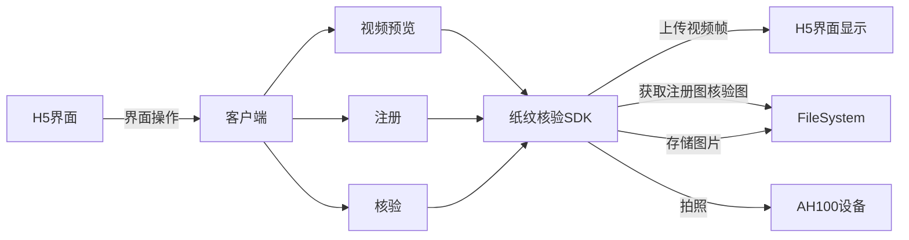

<!--
 * @Author: huturenji
 * @Date: 2023-09-19 10:45:22
 * @LastEditors: Please set LastEditors
 * @LastEditTime: 2023-09-11 17:08:50
 * @FilePath: /cpp-node/纸纹核验SDK接口文档.MD
 * @Description: 
   -->
## 纸纹核验SDK

### 整体架构




* H5界面，提供视频流预览，注册图录入、核验图片结果展示、查询注册列表

* 客户端，H5嵌入到客户端中，调用SDK方法

* SDK，纸纹核验的SDK，提供纸纹核验需要的一系列方法，包括视频预览、设置设备参数、拍照、纸纹注册、纸纹反射核验、纸纹透射核验

* AH100设备，拍照设备

* FileSystem，拍摄图片存储

  

### 功能

1、视频预览（设备参数控制）

2、拍照

3、纸纹注册

4、纸纹核验（反射/透射）

### 接口定义

#### preview（视频预览）

视频预览是从摄像头中读取到数据，并且将数据通过buffer的方式传输到对应的服务器上

接口地址

```
preview
```

请求参数

```
cameraId
server_url
```

返回数据

```json
{
	code:0,
    data:{
        buffer:buffer//图片buffer
    },
    message:'预览成功'
}
```


#### photo（拍照）

接口地址

```
photo
```

请求参数

```
cameraId
filepath
```

返回数据

```json
{
	code:0,
    data:{
    },
    message:'拍照成功'
}
```


#### parse_qrcode（二维码识别）

识别图片中的二维码

接口地址

```
parse_qrcode
```

请求参数

```
filepath
```

返回数据

```json
{
	code:0,
    data:{
        qrcode:xxx//二维码内容
    },
    message:'二维码识别成功'
}
```

code为0表示识别成功，其他值表示识别失败

#### register（注册）

接口地址

```
register
```

请求参数

```
id 用户输入注册图标签值
```

返回数据

```
{
	code:0,
    data:{
        labelHash：xxx//注册图的标签hash值 生成规则为，如果用户填写了id则使用id生成，否则使用图片的二维码内容生成
    },
    message:'注册成功'
}
```

code为0表示注册成功，其他值表示注册失败

#### verify（核验）

接口地址

```
verify
```

请求参数

```
registerFilepath 注册图路径
verifyFilepath 核验图路径
type 1表示反射核验，2表示透射核验
```

返回数据

```
{
	code:0,
    data:{
        result：0//0表示核验图相符 1表示核验图不相符
    },
    message:'核验成功'
}
```

code为0表示核验成功，其他值表示核验失败