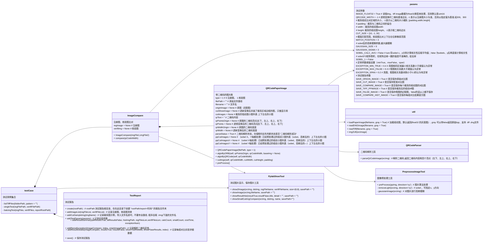

<!--
 * @Author: miaoju jun.miao@sinosun.com.cn
 * @Date: 2023-06-29 13:16:07
 * @LastEditors: miaoju jun.miao@sinosun.com.cn
 * @LastEditTime: 2023-08-02 14:08:15
 * @FilePath: /paperprintpy/README.md
 * @Description: 使用说明文档
-->
# PaperPrintPy
纸纹python验证程序

#### 测试程序python环境准备
###### 检查pip安装源
```python
    pip config list # 查看是否设置源，已经设置安装源的会有下面的显示
    global.index-url='https://pypi.mirrors.ustc.edu.cn/simple/'

    # 没有设置源的请先设置安装源，否则后面install很慢
    pip config set global.index-url https://pypi.mirrors.ustc.edu.cn/simple/
```

###### 安装依赖包
python版本最好 >= python3.9
根据自己电脑pip版本，可能是pip3
```python
    pip install opencv-python
    pip install matplotlib
    pip install numpy
    pip install rawpy
    pip install zxing-cpp
    pip install opencv-contrib-python
    pip install py-cpuinfo
    pip install PyQt5
    pip install piexif
    pip install pillow
    pip install exifread
```

dng2tiffFile.py 为dng转tiff工具，使用C++库模式转换时，第一次执行需要赋予可执行权限:
```shell
cd ./libdng/mac/inter
chmod +x test
```
注意：
- mac电脑需要安装opencv库
- 如果是mac m1芯片电脑，上面执行的是 "./libdng/mac/m1"目录下面的可执行文件

#### 整体流程示意:


#### 类图



#### 交互图


#### 使用说明
###### 1、GUI
可以直接执行gui.py，在界面中配置比对的注册图、核验图，以及算法参数


###### 2、直接代码编写testCase
testCase.py 中已经提供单组、批量比对方法：
```python
# 单组图片对比, 不会生成测试报告，只是把过程图片都show出来
def singleTest(regFilePath, verifiFilePath)

# 批量比对，中间过程不显示对比图，最后生成指定的测试报告
# regFiles 注册图列表
# verifiFiles 核验图列表
def batcingTest(regFiles, verifiFiles, reportRootPath, onlySameCompare = False, testDesc=''):
```

具体使用方式可以参考下面case写法:
```python
# --------------下面都是测试用例--------------------------------------------------------------------------------------  
# 获取指定文件夹下的所有tiff文件
def listTiffFiles(folder_path, pattern = "", no_pattern = ""):
    listfiles = []
    for file in os.listdir(folder_path):
        file_path = os.path.join(folder_path, file)
        if os.path.isfile(file_path) and (file.endswith(".tiff")  or file.endswith(".tif")):
            if pattern == "" or (pattern != "" and file.find(pattern) > -1) :
                if no_pattern == "" or file.find(no_pattern) < 0 :
                    # 在这里对每个文件进行操作，例如打印文件路径
                    print(file_path)
                    listfiles.append(file_path)

    return sorted(listfiles)

# single file test  case
def singleTestCase() :
    fileReg = "/Users/miaojun/Desktop/ppimg/new/1/dng/629/0001_1_629_J0.tiff"
    fileVerifi = "/Users/miaojun/Desktop/ppimg/new/1/dng/629/0001_1_629_J0_180_1.tiff"
    singleTest(fileReg, fileVerifi)

def batchingTestCase() :
    regFiles = listTiffFiles("/Users/miaojun/Desktop/sun3/","j0")
    verifiFiles = listTiffFiles("/Users/miaojun/Desktop/sun3/","j2")
    # /Users/miaojun/Desktop/ppimg/new
    reportRootPath = "/Users/miaojun/Desktop/sun3/" # 测试报告的根目录
    batcingTest(regFiles, verifiFiles, reportRootPath)

def batchingTestCase2() :
    regFiles = listTiffFiles("/Users/miaojun/Desktop/ppimg/new/11/20230621/","J0")
    verifiFiles = listTiffFiles("/Users/miaojun/Desktop/ppimg/new/11/20230621/","J2")
    # /Users/miaojun/Desktop/ppimg/new
    reportRootPath = "/Users/miaojun/Desktop/ppimg/new/11/20230621/" # 测试报告的根目录
    batcingTest(regFiles, verifiFiles, reportRootPath)

# 二维码不清晰、识别失败 case
def batchingTestCase3() :
    regFiles = listTiffFiles("/Users/miaojun/Desktop/ppimg/sgy000010/","j0")
    verifiFiles = listTiffFiles("/Users/miaojun/Desktop/ppimg/sgy000010/","j2")
    # /Users/miaojun/Desktop/ppimg/new
    reportRootPath = "/Users/miaojun/Desktop/ppimg/sgy000010/" # 测试报告的根目录
    batcingTest(regFiles, verifiFiles, reportRootPath)

# 测试代码，用于显示测试保存的纸纹图
def showCutTiff():
    regFile = "/Users/miaojun/Desktop/ppimg/new/11/20230621/report-20230705170608/img/0/regArea1.tiff"
    verifiFile = "/Users/miaojun/Desktop/ppimg/new/11/20230621/report-20230705170608/img/0/verifiArea1.tiff"
    regImg = cv.imread(regFile, cv.IMREAD_UNCHANGED)
    verImgImg = cv.imread(verifiFile, cv.IMREAD_UNCHANGED)
    showSmallCutImgCompare(regImg, verImgImg, "compare")
    return
# --------------上面都是测试用例--------------------------------------------------------------------------------------  

# singleTestCase()
# showCutTiff()
batchingTestCase2()
```

#### 测试报告
批量测试时会产生测试报告，报告为markdown文档，发布前可以手动编辑内容，可以使用工具导出pdf进行发布。
测试报告内容及样式，可以参考./report-sample.zip内容