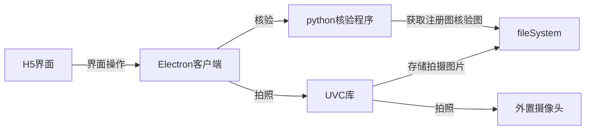
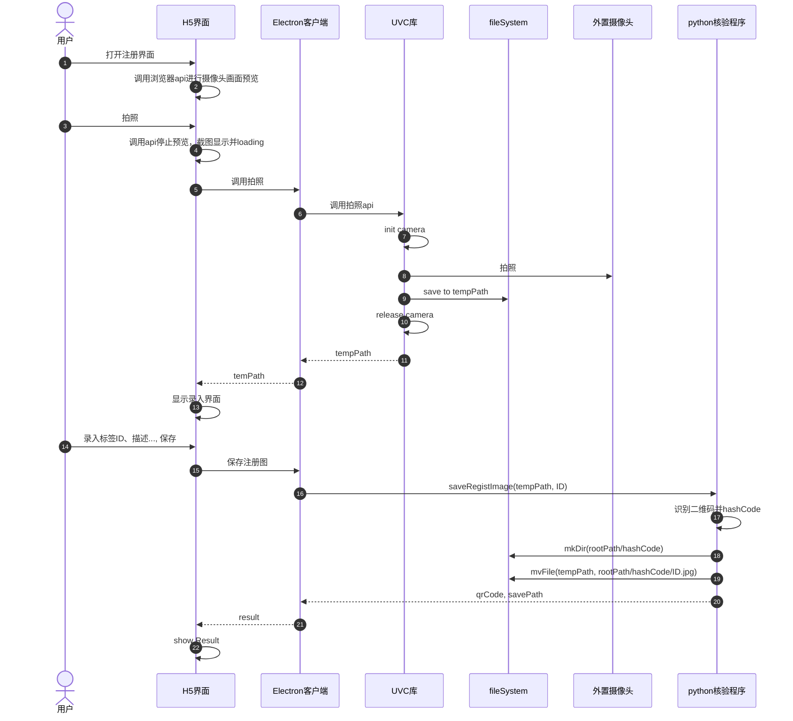
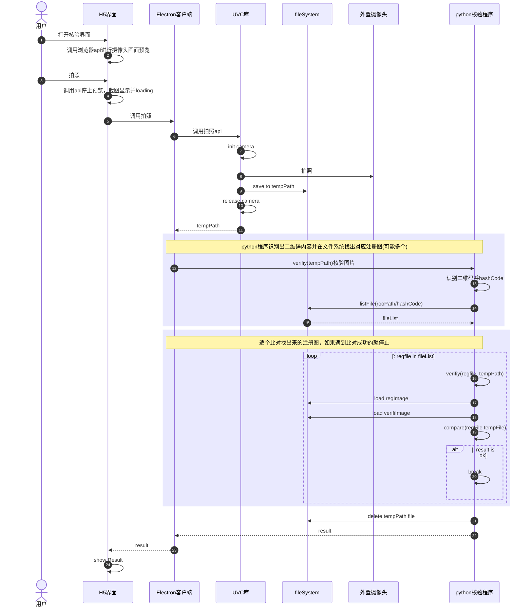
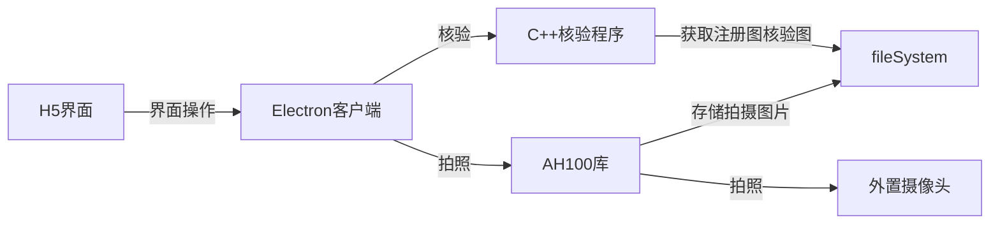
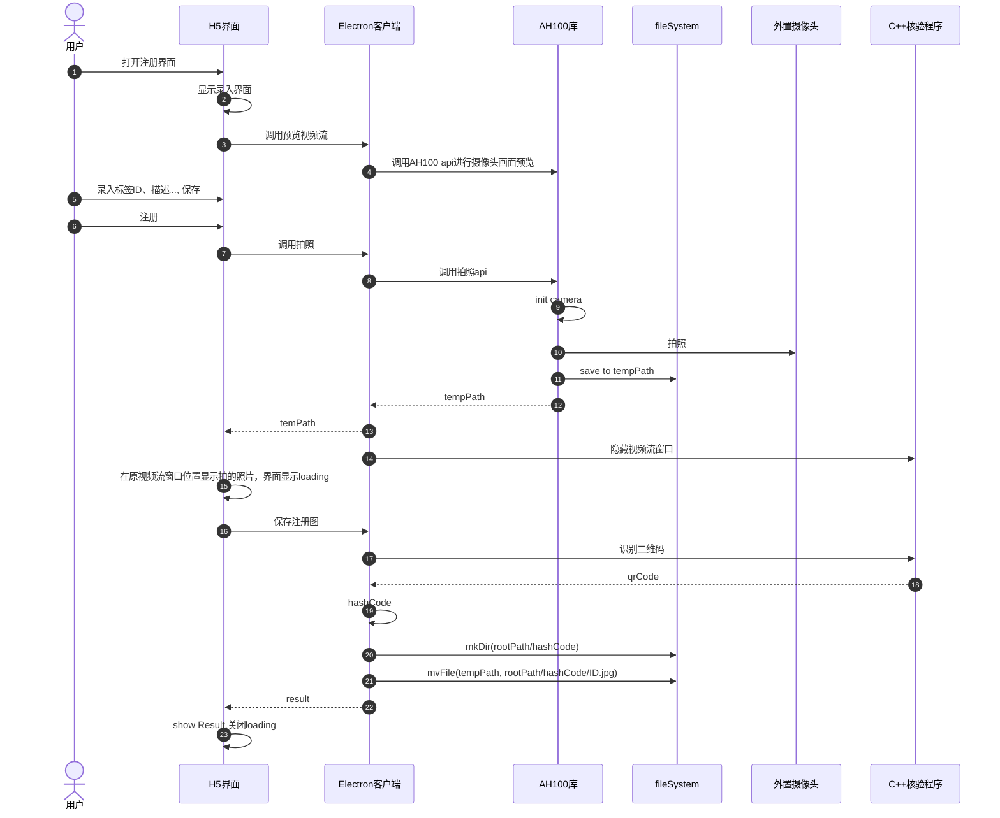
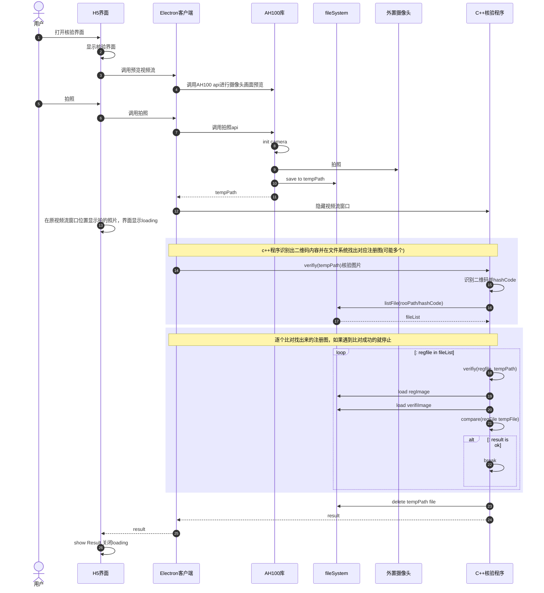

<!--
 * @Author: miaoju jun.miao@sinosun.com.cn
 * @Date: 2023-08-02 10:45:22
 * @LastEditors: miaoju jun.miao@sinosun.com.cn
 * @LastEditTime: 2023-08-02 15:13:44
 * @FilePath: /paperprint-py/pcUVC.MD
 * @Description: 这是默认设置,请设置`customMade`, 打开koroFileHeader查看配置 进行设置: https://github.com/OBKoro1/koro1FileHeader/wiki/%E9%85%8D%E7%BD%AE
-->
# 
 PC 客户端纸纹注册核验demo 

#### 整体模块架构(python版本)

* H5界面，提供摄像头预览，注册图录入、核验图拍摄并展示核验结果
* Electron客户端，为H5界面操作与UVC库、python核验流程做bridge桥接
* UVC库，C++程序部分，内部使用opencv封装的uvc协议调用外置摄像头进行拍照，并保存图片
* python核验程序，接受注册图、核验图本地文件地址作为入参，进行图片比对核验，并返回对比结果
* fileSystem，拍摄图片存储，按照“标签ID”、二维码内容索引到注册图

#### 交互时序(python版本)

###### 纸纹注册

###### 纸纹核验

#### 整体模块架构(C++版本)

* H5界面，提供摄像头预览，注册图录入、核验图拍摄并展示核验结果
* Electron客户端，为H5界面操作与UVC库、python核验流程做bridge桥接
* AH100库，C++程序部分，内部使用directshow封装的uvc协议调用外置摄像头进行拍照，并保存图片
* C++核验程序，接受注册图、核验图本地文件地址作为入参，进行图片比对核验，并返回对比结果
* fileSystem，拍摄图片存储，按照“标签ID”、二维码内容索引到注册图

#### 交互时序(C++版本)

###### 纸纹注册

###### 纸纹核验
