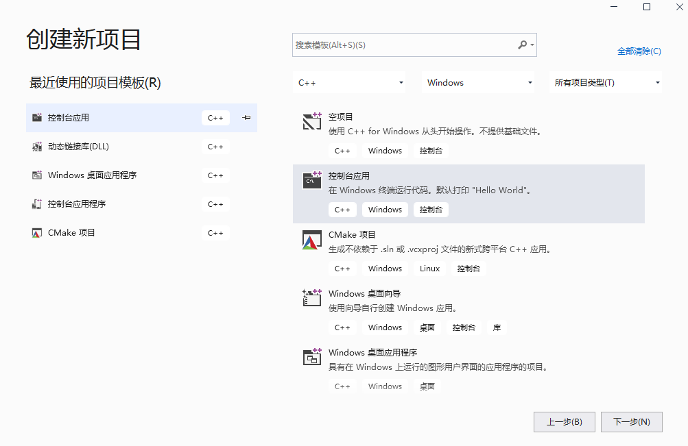
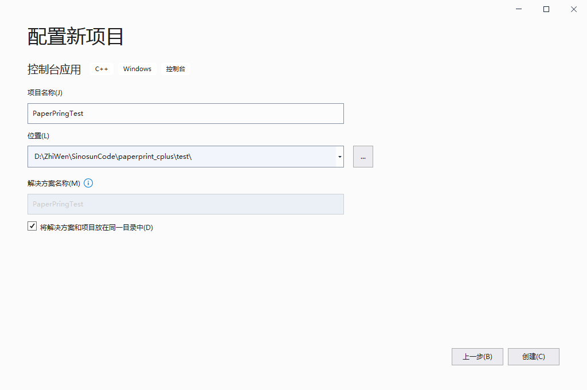
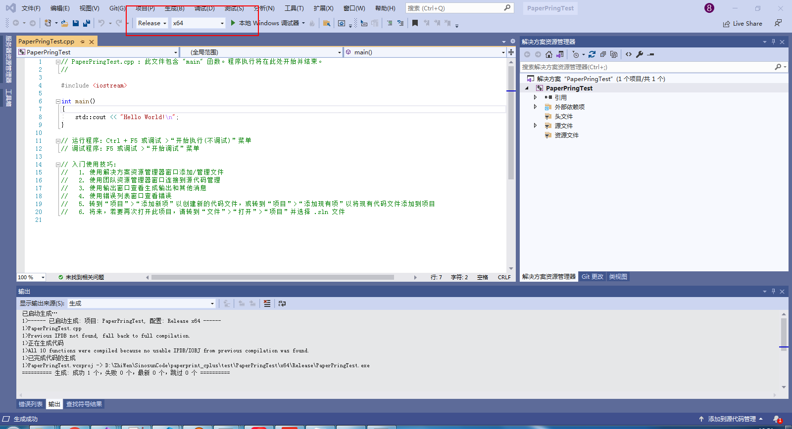
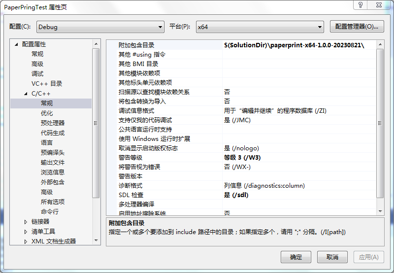
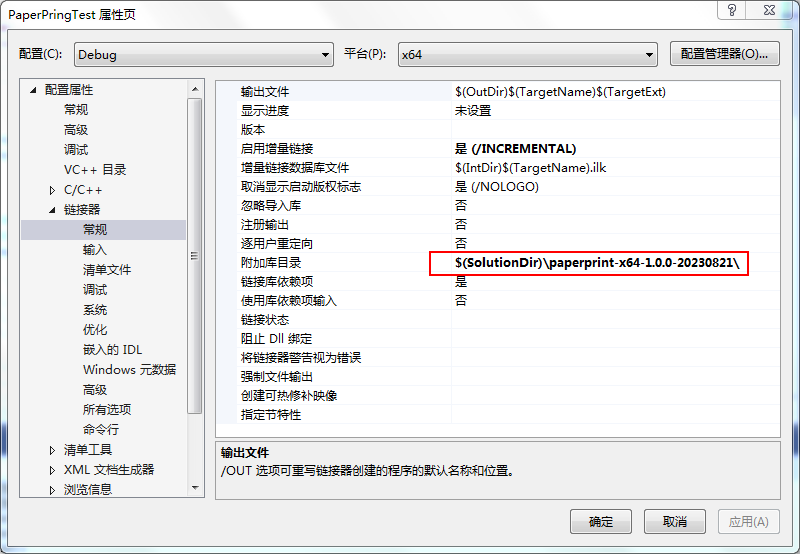
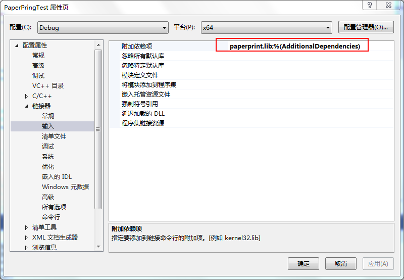
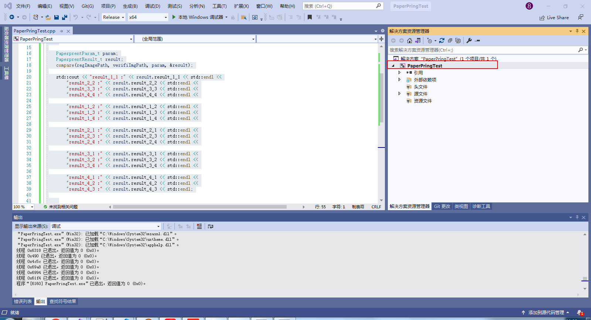
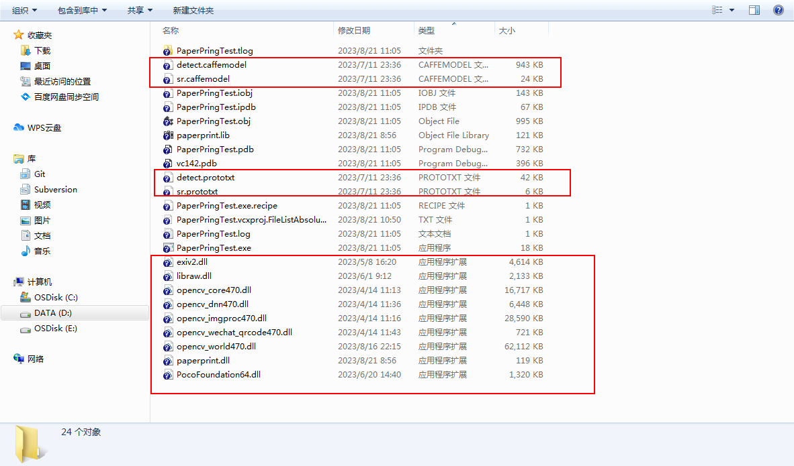
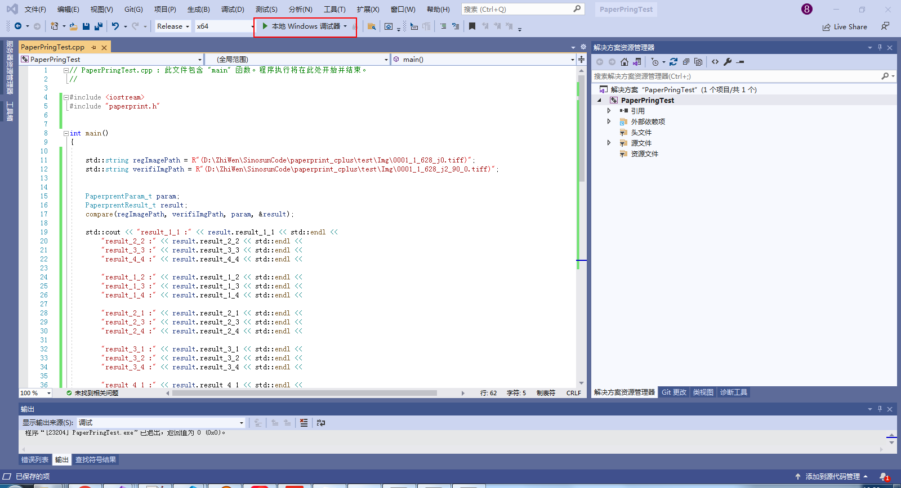
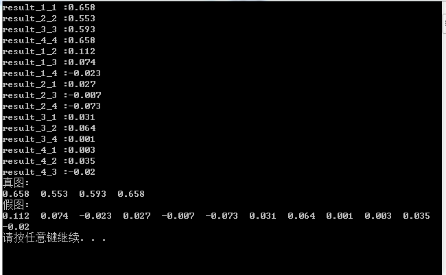

<!--
 * @FilePath: \paperprint_cplus\README.md
 * @Date: 2023-08-04 14:09:52
 * @Description: 
 * Copyright (c) 2023 by Sinosun Technology Co., Ltd. All Rights Reserved. 
-->
# PaperPrintCPLUS
纸纹验证程序 C++ 版本

## 构建
### 1.安装VS2019
安装教程参考 https://www.xjx100.cn/news/383336.html?action=onClick
### 2.打包
在\paperprint_cplus\build\windows\ 路径下打开命令行工具
运行 ```windows_release.bat 1 0 0``` （注：1 0 0为版本号1.0.0）
生成的库文件在 paperprint_cplus\build\windows\packagePath\SinoPaperprint-x64-1.0.0-20230821.zip

## 集成及使用
### 1.使用VS2019创建控制台应用
#### 创建控制台应用

#### 配置工程文件

#### 选择Release/x64

### 2.配置依赖文件及路径
#### 配置头文件路径

#### 配置依赖库文件路径

#### 配置依赖库文件

#### 添加测试代码，生成.exe文件

```C++
// PaperPringTest.cpp : 此文件包含 "main" 函数。程序执行将在此处开始并结束。
//

#include <iostream>
#include "SinoPaperprint.h"


int main()
{

	std::string regImagePath = R"(D:\ZhiWen\SinosunCode\paperprint_cplus\test\Img\0001_1_628_j0.tiff)";
	std::string verifiImgPath = R"(D:\ZhiWen\SinosunCode\paperprint_cplus\test\Img\0001_1_628_j2_90_0.tiff)";


	PaperprentParam_t param;
	PaperprentResult_t result;
	compare(regImagePath, verifiImgPath, param, &result);

	std::cout << "result_1_1 :" << result.result_1_1 << std::endl <<
		"result_2_2 :" << result.result_2_2 << std::endl <<
		"result_3_3 :" << result.result_3_3 << std::endl <<
		"result_4_4 :" << result.result_4_4 << std::endl <<

		"result_1_2 :" << result.result_1_2 << std::endl <<
		"result_1_3 :" << result.result_1_3 << std::endl <<
		"result_1_4 :" << result.result_1_4 << std::endl <<

		"result_2_1 :" << result.result_2_1 << std::endl <<
		"result_2_3 :" << result.result_2_3 << std::endl <<
		"result_2_4 :" << result.result_2_4 << std::endl <<

		"result_3_1 :" << result.result_3_1 << std::endl <<
		"result_3_2 :" << result.result_3_2 << std::endl <<
		"result_3_4 :" << result.result_3_4 << std::endl <<

		"result_4_1 :" << result.result_4_1 << std::endl <<
		"result_4_2 :" << result.result_4_2 << std::endl <<
		"result_4_3 :" << result.result_4_3 << std::endl;

	std::cout << "真图: " << std::endl <<
		result.result_1_1 << "  " <<
		result.result_2_2 << "  " <<
		result.result_3_3 << "  " <<
		result.result_4_4 << std::endl;

	std::cout << "假图: " << std::endl <<
		result.result_1_2 << "  " <<
		result.result_1_3 << "  " <<
		result.result_1_4 << "  " <<

		result.result_2_1 << "  " <<
		result.result_2_3 << "  " <<
		result.result_2_4 << "  " <<

		result.result_3_1 << "  " <<
		result.result_3_2 << "  " <<
		result.result_3_4 << "  " <<

		result.result_4_1 << "  " <<
		result.result_4_2 << "  " <<
		result.result_4_3 << std::endl;

	system("pause");
}

```
#### 在此处右键->生成

生成后的.exe在 paperprint_cplus\test\PaperPringTest\x64\Release\
### 3.拷贝.dll及依赖文件
将paperprint-x64-1.0.0-20230821文件夹里的所有.dll、.prototxt及.caffemodel拷贝到.exe所在的路径paperprint_cplus\test\PaperPringTest\x64\Release\

### 4.运行及结果
#### 点击运行

#### 运行结果

